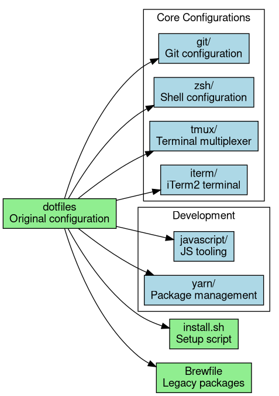

# Development Environment Configuration

This repository contains two versions of development environment configurations:
- [Original Configuration](dotfiles/README.md) - Traditional setup with iTerm2 and Yarn
- [Modern Configuration](dotfiles-modern/README.md) - Optimized setup with modern tools

## Configuration Comparison

### Original Configuration (dotfiles)


Key Features:
- iTerm2 as primary terminal
- Yarn for JavaScript package management
- Basic shell configuration with Prezto
- Limited version manager support
- Traditional CLI tools

### Modern Configuration (dotfiles-modern)


Key Improvements:
- WezTerm as modern terminal emulator
- Powerlevel10k for enhanced shell experience
- pnpm for efficient package management
- Comprehensive version management:
  - pyenv for Python
  - fnm for Node.js
  - SDKMAN for Java
  - rustup for Rust
- Modern CLI replacements:
  - ripgrep (grep)
  - fd (find)
  - bat (cat)
  - eza (ls)
- DBeaver for database management
- Improved development isolation

## Key Differences

1. Terminal Emulation:
   - Original: iTerm2 with basic configuration
   - Modern: WezTerm with GPU acceleration and modern features

2. Shell Experience:
   - Original: Basic Prezto setup
   - Modern: Optimized Prezto with Powerlevel10k integration

3. Package Management:
   - Original: Yarn for JavaScript
   - Modern: pnpm with efficient storage and better isolation

4. Development Tools:
   - Original: Basic development setup
   - Modern: Comprehensive tooling with version management

5. Command Line Tools:
   - Original: Traditional Unix tools
   - Modern: Performance-focused modern alternatives

## Installation

Choose the configuration that best suits your needs:

### Original Setup
```bash
git clone https://github.com/yourusername/dotfiles.git
cd dotfiles
./install.sh
```

### Modern Setup
```bash
git clone https://github.com/yourusername/dotfiles-modern.git
cd dotfiles-modern
./install.sh
```

## License

Both configurations are available under the same license terms. See [LICENSE](LICENSE) file.