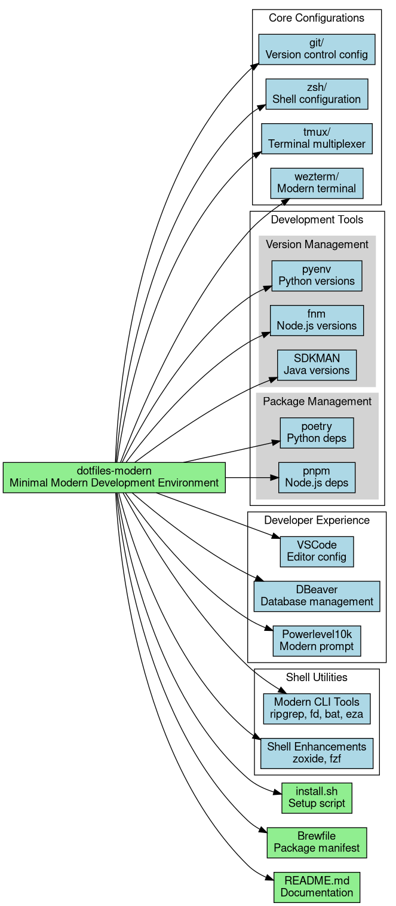

# Dotfiles Configuration

This repository contains dotfiles and configuration scripts for setting up a development environment. It's organized to manage various aspects of a development setup, from shell configuration to development tools.



## Repository Structure

### Core Configurations

- **git/** - Git configuration files
  - `gitconfig` - Global Git configuration
  - `gitignore` - Global Git ignore patterns
  
- **zsh/** - Zsh shell configuration
  - Core configuration files (`zshrc.zsh`, `zshenv.zsh`, etc.)
  - Modular configurations for aliases, functions, and prompts
  - Uses Prezto framework for enhanced functionality
  
- **tmux/** - Terminal multiplexer configuration
  - Platform-specific configurations for Linux and macOS
  - Custom key bindings and visual settings
  
- **iterm/** - iTerm2 terminal emulator settings
  - Color schemes and preferences
  
### Development Tools

- **javascript/** - JavaScript development configuration
  - ESLint configuration
  - Prettier configuration
  - Editor settings
  
- **yarn/** - Yarn package manager configuration
  - Global package settings
  - Linked packages configuration

### Installation

- `install.sh` - Main installation script
- `Brewfile` - Homebrew package definitions

## Current Limitations

1. Limited package manager support (primarily Homebrew/Yarn)
2. No dedicated Python environment management
3. No Rust toolchain configuration
4. Global package installation approach
5. No containerization support
6. Limited modern JavaScript tooling (no pnpm)

## Installation

```bash
git clone https://github.com/danielzurawski/dotfiles.git
cd dotfiles
./install.sh
```

## License

See [LICENSE](LICENSE) file