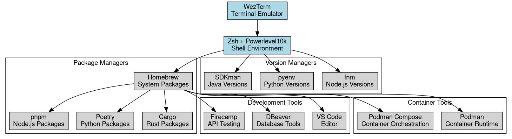

# Modern macOS Development Environment

A streamlined and minimalist dotfiles configuration for setting up a modern macOS development environment.



## Overview

Automated configuration for terminal, shell, and development tools with a focus on simplicity and maintainability. Designed to provide a complete yet minimal development environment for macOS.

## Core Components

### Terminal Environment
- **WezTerm**: Modern GPU-accelerated terminal emulator
- Custom theming and font rendering
- True color and ligature support

### Shell Configuration
- **Zsh**: Modern shell with advanced features
- **Powerlevel10k**: Fast, informative prompt
- Smart completions and history management

### Development Tools

#### Version Management
- **fnm**: Fast Node Version Manager
- **pyenv**: Python Version Manager
- **SDKman**: Java Development Kit Manager

#### Package Management
- **pnpm**: Node.js package manager
- **Poetry**: Python dependency management
- **Cargo**: Rust package manager

#### Applications
- Visual Studio Code
- DBeaver Community
- Firecamp (API testing)
- Podman + Podman Compose

## Quick Start

1. Clone the repository:
   ```bash
   git clone https://github.com/yourusername/dotfiles.git
   cd dotfiles
   ```

2. Run the installation script:
   ```bash
   ./install.sh
   ```

The script will:
- Install required dependencies via Homebrew
- Configure shell environment
- Set up development tools
- Create necessary symlinks
- Backup existing configurations

## Configuration

### File Structure
```
.
├── .gitignore           # Git ignore patterns
├── .p10k.zsh           # Powerlevel10k theme
├── .zshrc              # Shell configuration
├── Brewfile            # Package dependencies
├── install.sh          # Installation script
└── wezterm.lua         # Terminal configuration
```

### Local Customization
- Machine-specific settings: `~/.zshrc.local`
- Additional tools: Add to `Brewfile`

## Updating

```bash
# System packages
brew update && brew upgrade

# Development environments
fnm install --lts        # Node.js
pyenv update            # Python
sdk update             # Java
```

## Version History

Latest: v1.5.0 - Complete documentation and system visualization
See git tags for full history: `git tag -l`

## License

MIT License

## References

- [Homebrew](https://brew.sh/)
- [WezTerm](https://wezfurlong.org/wezterm/)
- [Powerlevel10k](https://github.com/romkatv/powerlevel10k)
- [fnm](https://github.com/Schniz/fnm)
- [pyenv](https://github.com/pyenv/pyenv)
- [SDKman](https://sdkman.io/)