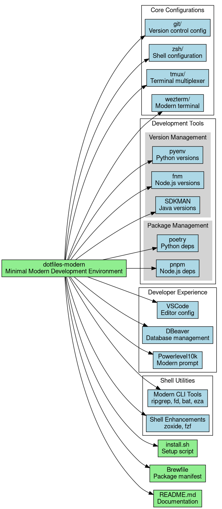

# Modern Development Environment Configuration (2024)

A minimal, complete development environment focused on modern tools and efficient workflows. This configuration provides a clean, isolated setup for Python, Node.js, Java, and Rust development while maintaining simplicity and avoiding redundancy.



## Core Features

### Version Management
- **Python**: pyenv for version control
- **Node.js**: fnm (Fast Node Manager)
- **Java**: SDKMAN for JDK and build tools
- **Rust**: rustup toolchain manager

### Package Management
- **Python**: poetry with in-project virtual environments
- **Node.js**: pnpm with efficient storage and strict dependency management
- **Java**: Maven/Gradle through SDKMAN
- **Rust**: cargo with integrated tooling

### Modern CLI Tools
- `ripgrep`: Fast code search (replaces grep)
- `fd`: Intuitive find alternative
- `bat`: Enhanced file viewing
- `eza`: Modern file listing
- `zoxide`: Smart directory navigation
- `fzf`: Fuzzy finder

### Development Tools
- **WezTerm**: Modern, GPU-accelerated terminal
- **DBeaver**: Universal database management
- **Visual Studio Code**: Configured editor
- **Docker**: Containerization support

## Shell Environment

### Core Configuration
- Zsh as primary shell
- Powerlevel10k for optimized prompt
- Modern shell experience with:
  - Instant prompt
  - Git integration
  - Development tool status
  - Directory navigation

### Directory Structure
```
dotfiles-modern/
├── git/               # Version control config
├── zsh/               # Shell configuration
│   ├── .p10k.zsh     # Powerlevel10k config
│   └── integrations/ # Tool-specific configs
├── tmux/              # Terminal multiplexer
├── wezterm/           # Terminal emulator
└── config/            # Tool configurations
```

## Installation

```bash
git clone https://github.com/yourusername/dotfiles-modern.git
cd dotfiles-modern
./install.sh
```

The installation process:
1. Detects OS and installs base dependencies
2. Sets up development environments
3. Configures tools and shell
4. Links configuration files

## Development Workflow

### Python Development
```bash
# Create new project
poetry new project-name
cd project-name

# Set Python version
pyenv local 3.12.0

# Install dependencies
poetry install

# Activate environment
poetry shell
```

### Node.js Development
```bash
# Set Node.js version
fnm use 20

# Initialize project
pnpm init

# Install dependencies
pnpm install

# Run scripts
pnpm dev
```

### Java Development
```bash
# Install JDK
sdk install java 21-graal

# Switch version
sdk use java 21-graal

# Create new project
sdk run springboot create
```

### Database Management
DBeaver provides:
- Multiple database support
- SQL editor and execution
- Schema visualization
- Data export/import

## Shell Features

### Powerlevel10k Prompt
- Instant prompt load
- Git status integration
- Tool version display
- Command execution time
- Error indication

### Modern Terminal
WezTerm provides:
- GPU acceleration
- True color support
- Modern font rendering
- Session management
- Advanced split layouts

## Best Practices

1. Project Isolation
   - Use virtual environments (Python)
   - Project-specific package management
   - Container-based development

2. Version Management
   - Store versions in project root
   - Use lockfiles for dependencies
   - Regular update schedule

3. Development Flow
   - Consistent script names
   - Standard port allocations
   - Environment variable structure

## Maintenance

Keep your environment updated:

```bash
# System updates
brew update && brew upgrade

# Language tools
poetry self update
pnpm update -g
sdk upgrade

# Shell environment
upgrade_dotfiles  # Custom function
```

## Integration Points

### Editor Configuration
```json
{
  "editor.formatOnSave": true,
  "terminal.integrated.fontFamily": "MesloLGS NF",
  "files.autoSave": "onFocusChange"
}
```

### Environment Structure
```
.env.example         # Template
.env.local          # Local settings
.env.development    # Dev config
.env.test           # Test config
```

## Support

For implementation details, see:
- [Shell Configuration Guide](docs/shell.md)
- [Tool Integration Guide](docs/integration.md)
- [Development Workflow](docs/workflow.md)

## License

See [LICENSE](LICENSE) file